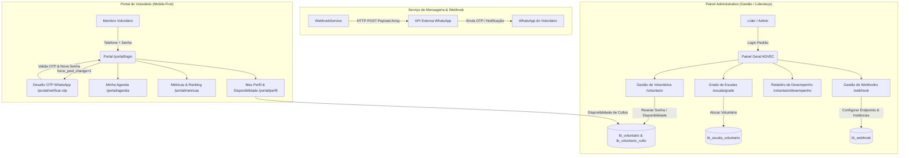
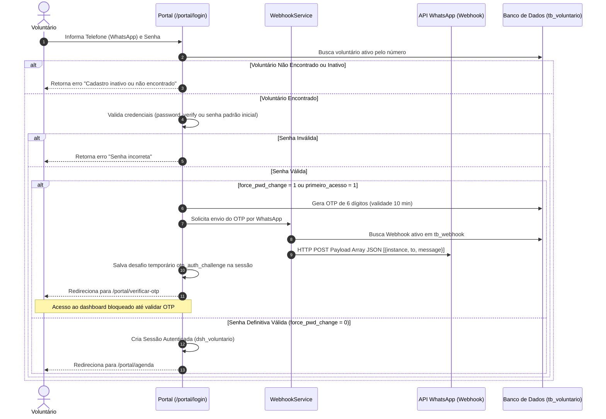
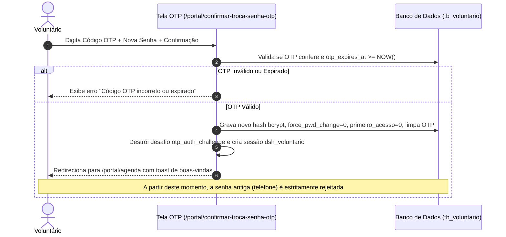
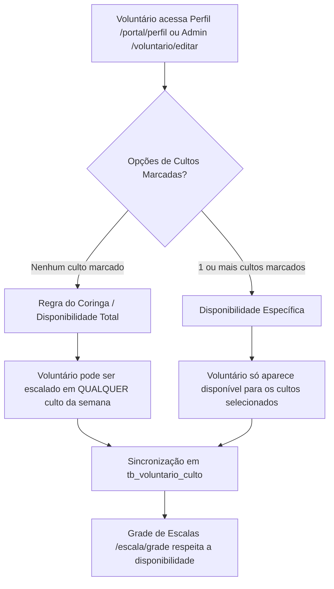

# Documentação do Portal do Voluntário, Segurança OTP & Gestão de Webhooks
**ADVEC Gestão - Sistema de Escalas, Engajamento e Segurança**

---

## 📌 1. Visão Geral do Sistema

Este documento descreve a arquitetura, fluxos operacionais, regras de negócio e estrutura de dados implementadas para o **Portal do Voluntário**, o **Módulo de Gestão de Webhooks**, a **Esteira de Segurança de Senha via OTP (WhatsApp)** e o **Módulo de Disponibilidade de Cultos (N:N)**.

O sistema opera em duas camadas integradas:
1. **Painel Administrativo (Liderança / Gestão)**:
   - Gestão de voluntários e líderes;
   - Cadastro e vinculação de sub-áreas de atuação;
   - Grade de cultos e alocação com validação de limites e conflitos;
   - Gestão de Webhooks para mensageria WhatsApp (Evolution API, Z-API, etc.);
   - Relatórios de desempenho, assiduidade e auditoria de cancelamentos.
2. **Portal Exclusivo do Voluntário (Mobile-First)**:
   - Autenticação e esteira de segurança com validação via OTP no WhatsApp;
   - Agenda mensal de escalas com confirmação/recusa rápida;
   - Configuração de disponibilidade para servir em cultos específicos ou geral (coringa);
   - Gamificação e ranking de fidelidade;
   - Edição de perfil e atualização segura de dados cadastrais e foto.

---

## 📐 2. Fluxos do Sistema (Diagramas Mermaid)

### A. Arquitetura Geral e Perfis de Acesso



---

### B. Fluxo de Autenticação com Esteira de Segurança OTP (WhatsApp)



---

### C. Fluxo de Confirmação de OTP e Redefinição de Senha



---

### D. Fluxo de Disponibilidade de Cultos para Servir (N:N)



---

## 🗂️ 3. Módulos e Funcionalidades Entregues

### 1. Gestão de Webhooks (Painel Administrativo)
- **Cadastro e Listagem (`/webhook`)**: Gestão de URLs de webhook e instâncias padrão de WhatsApp.
- **Teste em Tempo Real (`/webhook/testar`)**: Modal AJAX para envio de mensagem de teste para qualquer número de homologação.
- **`WebhookService`**:
  - Higienização e padronização automática com DDI 55 (ex: `5511999999999`).
  - Formatação obrigatória de payload HTTP POST em **Lista/Array JSON**:
    ```json
    [
      {
        "instance": "instancia_padrao_do_banco",
        "to": "5511999999999",
        "message": "Seu código de verificação é: 123456"
      }
    ]
    ```

### 2. Autenticação & Esteira de Segurança OTP
- **Interceptação de Primeiro Acesso e Reset**: Usuários com `force_pwd_change = 1` são obrigados a validar a posse do WhatsApp via OTP antes de acessar o sistema.
- **Reenvio de OTP com Timer**: Interface com contador regressivo de 60 segundos para evitar abusos de requisições de mensagens.
- **Bloqueio Estrito de Senha Padrão**: Após a definição da nova senha, o sistema rejeita o uso do número de telefone como senha.

### 3. Disponibilidade de Cultos (N:N)
- **Tabela Relacional `tb_voluntario_culto`**: Vincula voluntários a múltiplos `tb_culto_padrao`.
- **Regra do Coringa**: Deixar todos os cultos desmarcados representa disponibilidade total em qualquer dia/horário.

### 4. Portal do Voluntário & Perfil
- **Agenda Interativa (`/portal/agenda`)**: Ações rápidas de confirmação ou recusa com modal obrigatório de justificativa.
- **Métricas & Ranking (`/portal/metricas`)**: Gamificação baseada em assiduidade, presenças e confirmações.
- **Meu Perfil (`/portal/perfil`)**: Upload seguro de fotos em `FCPATH` com preview visual, edição de dados e redes sociais.

---

## 💻 4. Tabela de Rotas e Endpoints

| Método | Rota | Descrição | Filtro / Proteção |
| :--- | :--- | :--- | :--- |
| `GET/POST` | `/portal/login` | Tela e processamento de login do voluntário | Público |
| `GET` | `/portal/logout` | Encerra a sessão do voluntário | Público |
| `GET` | `/portal/verificar-otp` | Tela de desafio de código OTP e nova senha | Desafio OTP |
| `POST` | `/portal/confirmar-troca-senha-otp` | Valida OTP e conclui alteração da senha | Desafio OTP |
| `POST` | `/portal/reenviar-otp` | Dispara novo código OTP por WhatsApp | Desafio OTP |
| `GET` | `/portal/agenda` | Agenda mensal do voluntário | `auth_voluntario` |
| `POST` | `/portal/confirmarEscala` | Confirmação de presença em um culto | `auth_voluntario` |
| `POST` | `/portal/recusarEscala` | Recusa de presença com justificativa | `auth_voluntario` |
| `GET` | `/portal/metricas` | Tela de Métricas, Assiduidade e Ranking | `auth_voluntario` |
| `GET` | `/portal/perfil` | Formulário de perfil e disponibilidade | `auth_voluntario` |
| `POST` | `/portal/salvarPerfil` | Salva dados, foto e disponibilidade de cultos | `auth_voluntario` |
| `POST` | `/portal/alterarSenha` | Altera a senha no painel de perfil | `auth_voluntario` |
| `GET` | `/webhook` | Listagem de Webhooks cadastrados | `auth` (Admin) |
| `GET/POST` | `/webhook/novo` / `editar/(:num)` | Cadastro e edição de webhook | `auth` (Admin) |
| `POST` | `/webhook/salvar` | Salva configurações do webhook | `auth` (Admin) |
| `POST` | `/webhook/testar` | Teste de disparo de webhook via AJAX | `auth` (Admin) |
| `GET` | `/voluntario/desempenho` | Relatório de Desempenho e Cancelamentos | `auth` (Admin) |
| `POST` | `/voluntario/resetSenha` | Redefine senha do voluntário e ativa OTP | `auth` (Admin) |
| `GET` | `/voluntario/verificarTelefone` | Verifica existência global de voluntário por telefone | `auth` (Líder/Admin) |
| `POST` | `/voluntario/vincularRapido` | Vincula voluntário existente à sub-área do departamento | `auth` (Líder/Admin) |
| `GET` | `/voluntario/getSubareasPorDepartamento/(:num)` | Retorna sub-áreas ativas do departamento | `auth` (Líder/Admin) |
| `GET` | `/dashboard` | Painel inicial com suporte à view padrão de boas-vindas | `auth` |
| `GET` | `/resource` | Listagem e gestão da Resource Library (Materiais e Coleções) | `auth_sysadm` (SysAdm) |
| `GET/POST` | `/resource/novo` / `editar/(:num)` | Cadastro e edição de material avulso com auto-parsing | `auth_sysadm` (SysAdm) |
| `GET/POST` | `/resource/novaColecao` / `editarColecao/(:num)` | Gestão de coleções e playlists com drag-and-drop | `auth_sysadm` (SysAdm) |
| `GET` | `/resource/autoParseUrl` | Auto-Parser de links do YouTube, Spotify, Drive e PDFs | `auth_sysadm` (SysAdm) |
| `GET` | `/resource/getRecursosEscala` | Retorna materiais anexados a um culto e departamento | `auth_sysadm` / `auth` |
| `POST` | `/resource/anexarNaEscala` | Anexa materiais avulsos ou coleção desmembrada na escala | `auth_sysadm` / `auth` |
| `POST` | `/resource/removerDaEscala` | Desanexa material de um culto específico | `auth_sysadm` / `auth` |

---

### 5. Controle de Acesso Departamental para Gestores & Líderes
- **Tabela Relacional `tb_departamento_gestor`**: Associa os usuários do sistema (`tb_sys_usuario`) aos departamentos que eles gerenciam.
- **Filtro Estrito por Usuário Logado**:
  - Usuários líderes/gestores visualizam apenas voluntários e escalas dos departamentos atribuídos ao seu usuário.
  - No formulário de voluntários, sub-áreas de departamentos não gerenciados são exibidas desabilitadas (com cadeado e tooltip explicativo), preservando integridade das demais áreas do voluntário.
- **Gestão de Líderes no Cadastro de Departamento**:
  - No formulário de departamento (`/departamento/novo` e `/departamento/editar`), é possível selecionar diretamente quais usuários do sistema gerenciam a área.
- **Verificação Global de Telefone e Vinculação Rápida**:
  - Ao digitar o telefone no cadastro de novo voluntário, o sistema detecta se ele já serve em outro departamento e abre um modal rápido para adicioná-lo à equipe sem duplicar o cadastro principal.

### 6. View Padrão de Boas-Vindas (`_main/boas_vindas`)
- Tela inicial moderna e clean para recepção de todos os perfis de usuários.
- Saudação dinâmica (*Bom dia / Boa tarde / Boa noite*), cards de atalhos rápidos com base nas permissões do perfil, orientações gerais e suporte ao tema Dark/Light.

### 7. Biblioteca (Materiais de Apoio & Repertórios/Coleções)
- **Controle de Acesso RBAC & Departamental**:
  - Acesso ao módulo governado por permissões de perfil (`SessionModel` -> `$data['sys_action']->read/create/update/delete`).
  - No filtro e nas listagens de materiais e coleções, a opção **🌐 Global (Todos)** está sempre disponível para consulta e associação geral.
  - Os demais departamentos listados no combo e acessíveis para cadastro/gestão restringem-se estritamente aos departamentos autorizados ao usuário logado via `tb_departamento_gestor` (seguindo o mesmo conceito do módulo de voluntários).
- **Auto-Parsing Inteligente**:
  - YouTube: Extração de ID, geração de thumbnail (`hqdefault.jpg`) e URL segura de embed.
  - Spotify: Detecção de faixas/álbuns/playlists e geração de player nativo do Spotify.
  - Google Drive e PDFs: Modo de pré-visualização inline e visualizadores integrados.
- **Coleções (Playlists) & Desmembramento em Escalas por Sub-área**:
  - Permite criar coleções e ordenar os materiais via Drag-and-Drop.
  - Ao anexar materiais ou coleções a um culto, o líder pode definir o destino: **🌐 Geral (Todas as Sub-áreas)** ou uma **Sub-área específica** (ex: Louvor - Backing Vocal).
  - Na grade mensal de escalas (`/escala/grade`), os cultos com materiais exibem um indicador/badge com a contagem exata de materiais anexados.
- **Visão do Voluntário (Mobile-First)**:
  - Na tela de Agenda (`/portal/agenda`), o voluntário visualiza exclusivamente os materiais gerais do departamento somados aos materiais direcionados à sua sub-área de atuação escalada, com reprodutor nativo em modal interativo.

### 8. Experiência Visual do Portal, Tema & Redes Sociais
- **Seletor de Tema (Dark / Light / Automático)**:
  - Toggle de tema no menu superior ([`_nav.php`](file:///Users/elpidio.junior/Documents/_projetos/advec/ci-advec/app/Views/portal_voluntario/_nav.php)) ao lado do avatar do usuário.
  - Script anti-flicker no `<head>` de todas as páginas do portal para renderização imediata da preferência salva em `localStorage` ou detecção nativa do sistema operacional (`prefers-color-scheme`).
  - Paleta equilibrada com alto contraste para evitar sobreposição de elementos escuros.
- **Redes Sociais & UX Mac Dock ([`perfil.php`](file:///Users/elpidio.junior/Documents/_projetos/advec/ci-advec/app/Views/portal_voluntario/perfil.php))**:
  - Micro-compositor expansível `+` para cadastro instantâneo de redes sociais apenas digitando o *handle/nickname* ou URL completa (com resolução automática de URLs raiz para Instagram, LinkedIn, TikTok, YouTube, Facebook, X/Twitter, Threads, GitHub, etc.).
  - Lista visual inspirada na Dock do macOS com efeito suave de levitação (`hover lift`) e links externos com segurança `rel="noopener noreferrer"`.
  - Agrupamento das sub-áreas de atuação por departamento com espaçamento simétrico (`py-3`) e cores institucionais.
- **Métricas, Assiduidade & Comparativo com Mês Anterior ([`metricas.php`](file:///Users/elpidio.junior/Documents/_projetos/advec/ci-advec/app/Views/portal_voluntario/metricas.php))**:
  - Comparativo dinâmico de escalas servidas em relação ao mês anterior.
  - Ajuste estético dos cards de KPI (remoção de círculos pesados ao redor dos ícones e adoção do ícone de joinha para baixo `bi-hand-thumbs-down-fill` para recusas/ausências).
  - Dimensionamento responsivo de badges e tags de status.
- **Centralização e Refinamento da Tela de Login ([`login.php`](file:///Users/elpidio.junior/Documents/_projetos/advec/ci-advec/app/Views/portal_voluntario/login.php))**:
  - Alinhamento vertical e horizontal perfeito em 100% da altura do viewport (`min-height: 100dvh`).
  - Fundo com gradiente radial fixo e contínuo, eliminando faixas ou cortes no rodapé.
  - Atualização dos metadados PWA ([`manifest.json`](file:///Users/elpidio.junior/Documents/_projetos/advec/ci-advec/public/manifest.json)).
- **Interoperabilidade e Normalização de Dados de Redes Sociais**:
  - Compatibilização bidirecional entre o painel administrativo ([`voluntario-form.php`](file:///Users/elpidio.junior/Documents/_projetos/advec/ci-advec/app/Views/voluntario/voluntario-form.php) / [`Voluntario.php`](file:///Users/elpidio.junior/Documents/_projetos/advec/ci-advec/app/Controllers/Voluntario.php)) e o portal do voluntário ([`PortalVoluntario.php`](file:///Users/elpidio.junior/Documents/_projetos/advec/ci-advec/app/Controllers/PortalVoluntario.php)), gravando e lendo chaves `rede`/`link` e `plataforma`/`url` com *null coalescing* seguro.

---

### 9. Avatar Stack (Facepile) & Modal de Participantes da Equipe
- **Facepile no Card de Escala ([`agenda.php`](file:///Users/elpidio.junior/Documents/_projetos/advec/ci-advec/app/Views/portal_voluntario/agenda.php))**:
  - Exibe miniaturas circulares sobrepostas dos voluntários escalados para o mesmo dia e culto, com recorte estético adaptado ao Dark/Light mode (`border: 2px solid var(--portal-card-bg)`).
  - Indicador numérico `+X` quando o número de participantes excede 3 membros.
  - Regra de negócio: o próprio voluntário logado é filtrado e não aparece em sua própria pilha/modal de equipe.
- **Modal / Bottom Sheet de Contatos & Senioridade**:
  - Layout refinado com tipografia equilibrada (sem tabelas pesadas), cards limpos para cada membro da equipe.
  - Exibição de função e nível de senioridade (ex: *Iniciante, Intermediário, Avançado*).
  - Ações rápidas de contato: botão direto para WhatsApp (`https://wa.me/...`) e ícones clicáveis das redes sociais cadastradas pelo voluntário.

### 10. Gestão de Escalas: Filtro de Dias, Navegação & Bloqueio Retroativo
- **Filtro Inteligente de Dias no Mês Corrente ([`escala-grade.php`](file:///Users/elpidio.junior/Documents/_projetos/advec/ci-advec/app/Views/escala/escala-grade.php))**:
  - No mês atual, renderiza por padrão apenas os cultos a partir da data de hoje (`data >= hoje`).
  - Switch interativo *"Exibir dias anteriores (X)"* permite ao gestor alternar a visualização dos dias passados sob demanda sem recarregar a página.
  - Em meses anteriores selecionados no histórico, todos os dias do mês são exibidos automaticamente.
- **Navegação Otimizada de Meses**:
  - Barra superior exibe o mês atual e meses futuros para planejamento.
  - Dropdown *"Meses anteriores"* lista exclusivamente meses passados que possuem escalas registradas no banco de dados.
  - Paleta com alto contraste (Slate/Cyan/Índigo) eliminando sobreposição visual entre abas e ícones.
- **Bloqueio de Edição Retroativa & Ação `update_past` ([`Escala.php`](file:///Users/elpidio.junior/Documents/_projetos/advec/ci-advec/app/Controllers/Escala.php))**:
  - Cultos com data anterior à data atual (`data < hoje`) entram em modo leitura estrito.
  - Usuários sem a permissão `update_past` são impedidos de adicionar voluntários, trocar sub-áreas, excluir membros ou registrar presenças retroativas.
  - Na grade de escalas, a coluna de Ações exibe o status centralizado `🔒 Encerrado` para usuários sem permissão especial.
- **Penalização de Omissão no Ranking / Gamificação ([`PortalVoluntario.php`](file:///Users/elpidio.junior/Documents/_projetos/advec/ci-advec/app/Controllers/PortalVoluntario.php))**:
  - Voluntários não podem confirmar ou recusar escalas após a realização do culto.
  - Escalas passadas pendentes de resposta são tratadas como omissão/falta (`NAO_CONFIRMADO`), aplicando penalização de **-25 pontos** no Score de Fidelidade / Ranking.

### 11. Gestão Dinâmica de Ações de Módulos (SysModulo)
- **Componente Interativo de Tags ([`sys-modulo-form.php`](file:///Users/elpidio.junior/Documents/_projetos/advec/ci-advec/app/Views/_acesso/sys_modulo/sys-modulo-form.php))**:
  - Substituição de checkboxes estáticos por input dinâmico de Tags/Chips.
  - Permite digitação livre de novas ações (ex: `update_past`, `export`, `approve`) com normalização automática para `snake_case`.
  - Pílulas com sugestões rápidas (`read`, `create`, `update`, `delete`, `update_past`) para adição com 1 clique.
  - Sincronização automática com a tabela `tb_sys_modulo_acao` e vinculação imediata das novas ações ao perfil de Administrador (`SysAdm`).

---

## 🗄️ 5. Scripts de Banco de Dados (`scripts_deploys/`)

| Script de Deploy | Script de Rollback | Descrição |
| :--- | :--- | :--- |
| [`29092026_portal_voluntario.sql`](file:///Users/elpidio.junior/Documents/_projetos/advec/ci-advec/scripts_deploys/29092026_portal_voluntario.sql) | `29092026_portal_voluntario_rollback.sql` | Estrutura base do portal e confirmação de escalas |
| [`29092026_relatorio_desempenho_voluntarios.sql`](file:///Users/elpidio.junior/Documents/_projetos/advec/ci-advec/scripts_deploys/29092026_relatorio_desempenho_voluntarios.sql) | `29092026_relatorio_desempenho_voluntarios_rollback.sql` | Índices de performance para relatórios |
| [`30092026_disponibilidade_voluntarios_cultos.sql`](file:///Users/elpidio.junior/Documents/_projetos/advec/ci-advec/scripts_deploys/30092026_disponibilidade_voluntarios_cultos.sql) | `30092026_disponibilidade_voluntarios_cultos_rollback.sql` | Tabela relacional `tb_voluntario_culto` (N:N) |
| [`30092026_modulo_webhooks_e_otp.sql`](file:///Users/elpidio.junior/Documents/_projetos/advec/ci-advec/scripts_deploys/30092026_modulo_webhooks_e_otp.sql) | `30092026_modulo_webhooks_e_otp_rollback.sql` | Tabela `tb_webhook`, colunas de OTP e ativação de troca |
| [`01102026_controle_acesso_departamento_gestor.sql`](file:///Users/elpidio.junior/Documents/_projetos/advec/ci-advec/scripts_deploys/01102026_controle_acesso_departamento_gestor.sql) | `01102026_controle_acesso_departamento_gestor_rollback.sql` | Tabela `tb_departamento_gestor` para controle de acesso departamental |
| [`01102026_resource_library_tables.sql`](file:///Users/elpidio.junior/Documents/_projetos/advec/ci-advec/scripts_deploys/01102026_resource_library_tables.sql) | `01102026_resource_library_tables_rollback.sql` | Tabelas `resource_types`, `resources`, `collections`, `collection_resources`, `schedule_resources` |
| [`02102026_avatar_stack_participantes_escala.sql`](file:///Users/elpidio.junior/Documents/_projetos/advec/ci-advec/scripts_deploys/02102026_avatar_stack_participantes_escala.sql) | `02102026_avatar_stack_participantes_escala_rollback.sql` | Índices para otimização da consulta de participantes da equipe |
| [`02102026_gestao_escalas_bloqueio_retroativo_ranking.sql`](file:///Users/elpidio.junior/Documents/_projetos/advec/ci-advec/scripts_deploys/02102026_gestao_escalas_bloqueio_retroativo_ranking.sql) | `02102026_gestao_escalas_bloqueio_retroativo_ranking_rollback.sql` | Cadastro da permissão `update_past` no módulo de escalas e índices de status/pontuação |


