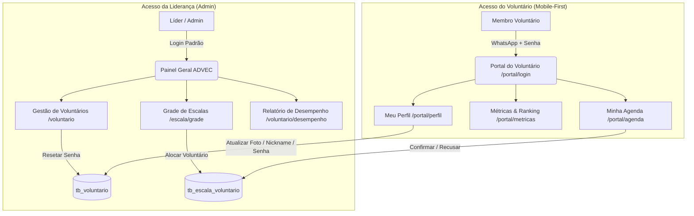
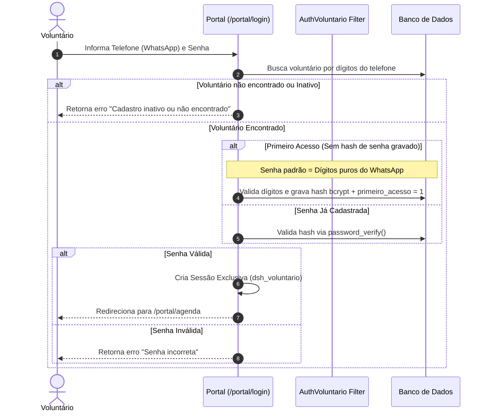
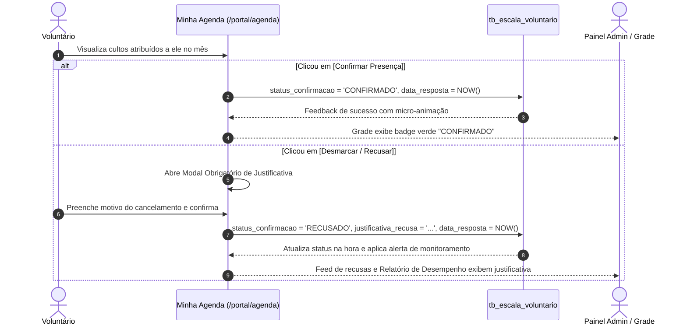
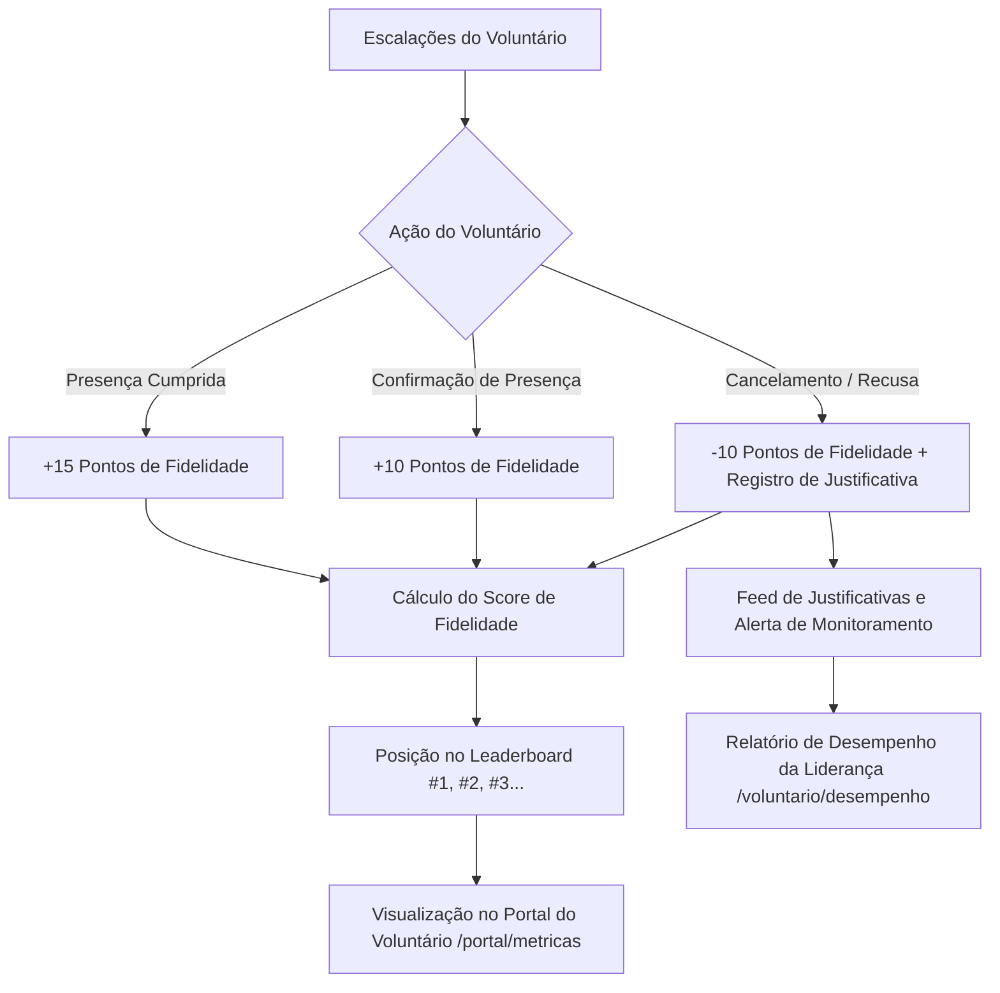

# Documentação do Portal do Voluntário & Gestão de Desempenho
**ADVEC Gestão - Sistema de Escalas e Engajamento de Voluntários**

---

## 📌 1. Visão Geral do Sistema

Este documento descreve a arquitetura, fluxos operacionais, regras de negócio e estrutura de dados implementadas para o **Portal do Voluntário** e o **Módulo de Relatórios de Desempenho e Cancelamentos**.

O sistema agora possui duas camadas integradas:
1. **Painel Administrativo (Liderança / Gestão)**: Permite cadastrar voluntários, definir sub-áreas de atuação, montar a grade de cultos, redefinir senhas e auditar o desempenho geral e motivos de cancelamento.
2. **Portal Exclusivo do Voluntário (Mobile-First)**: Interface responsiva e gamificada para o voluntário consultar suas escalas, confirmar ou recusar com justificativa, gerenciar seus dados cadastrais e acompanhar seu score no ranking.

---

## 📐 2. Fluxos do Sistema (Diagramas Mermaid)

### A. Arquitetura Geral e Perfis de Acesso

---

### B. Fluxo de Autenticação do Voluntário

---

### C. Fluxo de Confirmação e Recusa de Escalas (Com Justificativa)

---

### D. Fluxo de Gamificação, Ranking e Monitoramento

---

## 🗂️ 3. Módulos e Funcionalidades Entregues

### 1. Portal do Voluntário
- **Login Rápido (`/portal/login`)**: Autenticação com número do WhatsApp e senha (inicialmente os próprios dígitos do telefone).
- **Minha Agenda (`/portal/agenda`)**: Lista mensal de cultos do voluntário com botões de ação rápida `[Confirmar Presença]` e `[Desmarcar / Recusar]`.
- **Métricas & Ranking (`/portal/metricas`)**:
  - Hero Card com posição no pódio (🥇 🥈 🥉) e pontos de fidelidade.
  - Cards de Cultos Aceitos, Cancelamentos e Taxa de Assiduidade %.
  - Leaderboard geral e alerta explícito de monitoramento de cancelamentos.
- **Meu Perfil (`/portal/perfil`)**:
  - Upload de foto com preview imediato.
  - Edição de Nickname, WhatsApp, Data de Nascimento e Links de Redes Sociais.
  - Alteração segura de senha de acesso.
  - Visualização somente leitura de departamentos e áreas de atuação.

### 2. Painel Administrativo (Liderança)
- **Reset de Senha do Voluntário**: Botão com modal de confirmação na listagem (`/voluntario`) e edição (`/voluntario/editar/{id}`) que redefine a senha do voluntário para o padrão limpo do WhatsApp via AJAX.
- **Relatório de Desempenho & Cancelamentos (`/voluntario/desempenho`)**:
  - Filtros por período, departamento, busca e checkbox *"Apenas com cancelamentos"*.
  - KPIs consolidados: Total de Escalações, Presenças, Cancelamentos e Taxa Geral.
  - Tabela completa de desempenho e assiduidade por voluntário.
  - Mural geral de justificativas de cancelamento e modal detalhado por membro.

---

## 💻 4. Tabela de Rotas e Endpoints

| Método | Rota | Descrição | Filtro / Proteção |
| :--- | :--- | :--- | :--- |
| `GET/POST` | `/portal/login` | Tela e processamento de login do voluntário | Público |
| `GET` | `/portal/logout` | Encerra a sessão do voluntário | Público |
| `GET` | `/portal/agenda` | Agenda mensal do voluntário logado | `auth_voluntario` |
| `POST` | `/portal/confirmarEscala` | Confirmação de presença em um culto | `auth_voluntario` |
| `POST` | `/portal/recusarEscala` | Recusa de presença com justificativa | `auth_voluntario` |
| `GET` | `/portal/metricas` | Tela de Métricas, Assiduidade e Ranking | `auth_voluntario` |
| `GET` | `/portal/perfil` | Formulário de edição de dados e senha | `auth_voluntario` |
| `POST` | `/portal/salvarPerfil` | Salva alterações de dados e foto | `auth_voluntario` |
| `POST` | `/portal/alterarSenha` | Altera a senha do voluntário | `auth_voluntario` |
| `GET` | `/voluntario/desempenho` | Relatório de Desempenho e Cancelamentos | `auth` (Admin) |
| `GET` | `/voluntario/getJustificativas/(:num)` | Retorna justificativas de um voluntário (AJAX) | `auth` (Admin) |
| `POST` | `/voluntario/resetSenha` | Redefine senha do voluntário para padrão | `auth` (Admin) |

---

## 🗄️ 5. Scripts de Banco de Dados (`scripts_deploys/`)

Todos os scripts SQL foram estruturados com validações idempotentes (`INFORMATION_SCHEMA`) para execução manual segura:

1. **[`29092026_portal_voluntario.sql`](file:///Users/elpidio.junior/Documents/_projetos/advec/ci-advec/scripts_deploys/29092026_portal_voluntario.sql)**:
   - Adiciona colunas de autenticação em `tb_voluntario` (`senha`, `primeiro_acesso`, `data_ultimo_login`, `data_ultima_senha`).
   - Adiciona campos de resposta em `tb_escala_voluntario` (`status_confirmacao`, `justificativa_recusa`, `data_resposta`).
2. **[`29092026_relatorio_desempenho_voluntarios.sql`](file:///Users/elpidio.junior/Documents/_projetos/advec/ci-advec/scripts_deploys/29092026_relatorio_desempenho_voluntarios.sql)**:
   - Adiciona índices `idx_status_confirmacao` e `idx_data_culto` para otimização de consultas e relatórios.
3. **Scripts de Rollback**:
   - `29092026_portal_voluntario_rollback.sql`
   - `29092026_relatorio_desempenho_voluntarios_rollback.sql`
